+++
title = "Circle ($CRCL) 股價狂漲 7 倍 — 是泡沫還是穩定幣的 iPhone 時刻"
date = 2025-06-22T19:45:36+08:00
draft = false
series = ["Crypto"]
description = "分析 Circle ($CRCL) 上市後的漲勢原因、生意本質以及潛在風險，探討穩定幣市場的未來。"
+++

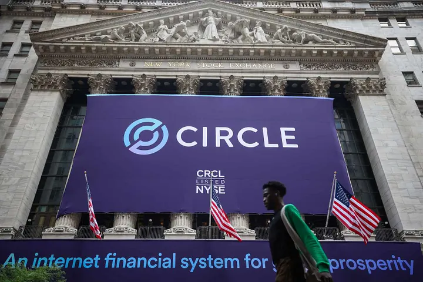

[Circle ($CRCL)](https://www.circle.com/)，美元穩定幣 USDC 的發行商，自 6 月 5 日在紐約證交所上市以來，**股價從 IPO 發行價 31 美元一路飆升至超過 240 美元，漲幅高達近 675%，市值突破 500 億美元**。這樣的漲勢在美股市場中堪稱現象級，特別是在加密貨幣與傳統金融交匯的領域，Circle 被冠以「穩定幣第一梯隊」的稱號，成為過去兩週美股市場中最閃亮的那顆星。

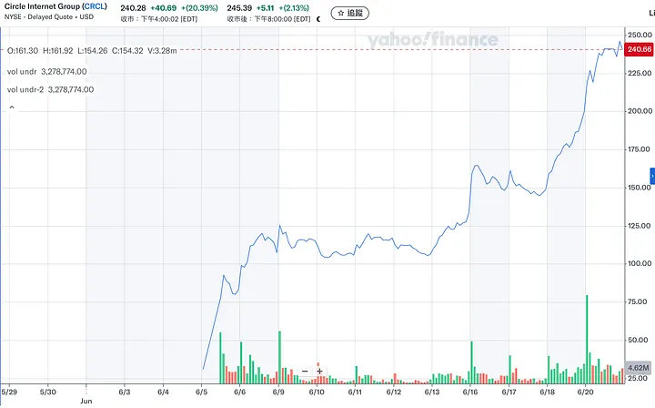
>>>>>>>> *How to lose*

在這篇文章中，我想要透過分享 **Circle 的生意本質**，以及**三個利好**來幫助大家更了解 Circle 近期股價不斷上漲的原因。同時，我也將點出從招股書、行業現狀我所看到的**三個風險**來進行完整的分析。

## TL;DR
> 我認為 Circle 目前極度 overpriced （截至 6/22 寫稿的當下，收盤價為 $240.28），市場似乎 overindex on GENIUS 法案通過對 Circle 的利好，但 Circle 和 Coinbase 之間的近乎不平等條約長期上仍為限制 Circle 發展的緊箍咒，且 Circle 本身將面臨降息循環，以及多個穩定幣梯隊前仆後繼的競爭，目前我個人的認知是股價正被嚴重高估，泡沫結束後的踩踏效應會非常嚴重。

## Circle 的生意本質：透過發行穩定幣來穩定賺取利差
Circle 的生意模式非常簡單粗暴：用戶存入 $1 的美金給 Circle，Circle 便會發行 1 個 USDC，一種與美元 1:1 掛鉤的穩定幣，在不同的應用場景中供用戶使用（如DeFi、鏈上轉帳、 Settlement 等）。Circle 背後再將這些用戶存入的美金透過購入短債來賺取利息。

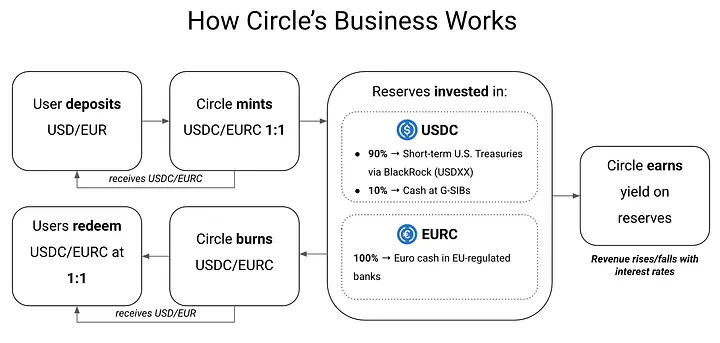
>>>>>>>*src: [digitalfinancebriefing](https://digitalfinancebriefing.substack.com/p/from-token-to-ticker-circles-bet-on-public-market-trust)*

將 Circle 的招股書攤開來看，2024 年幾乎所有營收都來自於賺取利息差這樣的生意模式，用資產管理的模式來思考，他就是一個 AUM-based 的 business model，而每年約可以賺取總 AUM 4–4.5% 的營收。

Circle 的成本部分我們後面還會再展開，但基本上最大宗的成本項為分潤給 distribution channels 的費用，其佔 2024 年總營收約為 60%，而這其中最重要的分潤夥伴為 Coinbase：2024 財年 Circle 約分潤了 9 億美金給 Coinbase。扣掉這樣的 distribution partner cost，以及其他一些零零總總的費用後，Circle 大約是一家一年 top line 能做 16.8 億美金營收、bottom line 能有 1.55 億美金的公司（9.28% 淨利潤率）。

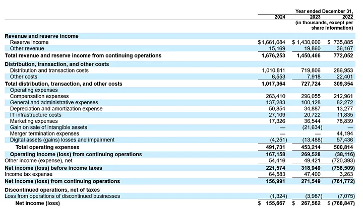
>>>>>>>> *src: SEC*

Circle/USDC 如何運營對在圈子內的人來說早就見怪不怪，大家都知道是一個非常好的生意模式，唯一的問題就是現在看起來非常貴。目前 Circle 的市值為 582.75 億美金，隱含的是 34 倍的 P/S 以及 375 倍的 P/E。

到底為什麼市場願意給其這麼高的 Premium？

## 原因一：華爾街對於穩定幣支付的看好 + 可投資標的稀缺性
USDC 表面上是個穩定幣，背後隱含的是整體金融體系結算系統的革新。在這篇文章不過度展開整體結算、支付的市場有多大，但我們可以想像，隨著越來越多結算系統選擇使用更快、更便宜的穩定幣，這很大程度會吃掉傳統 Fintech 巨頭的蛋糕，如 VISA、ACH 等等，事實上，從交易量的角度來看，這件事情似乎已經在發生：

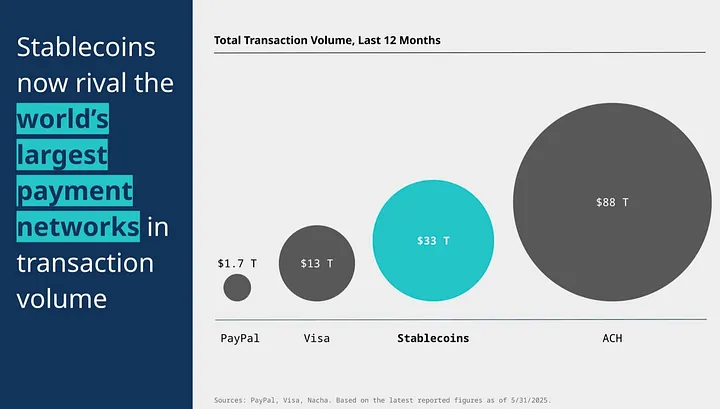

因為這些 upsides，從整體市場大小來看，穩定幣的成長似乎是注定將發生的。穩定幣目前總發行量約在兩千五百億美金這個量體，而多家金融機構給出的報告都預測 2028 年整體穩定幣市場會達到兩兆美金（甚至以上）的量體，也就是約三年八倍的成長幅度。

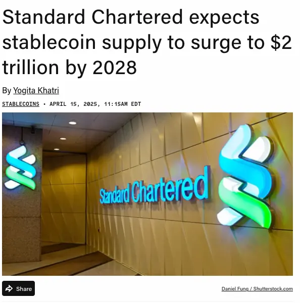

而現在市場上的狀況比較像是，大家都知道穩定幣很好，接下來幾年市場會不斷變大。而 Circle 作為公開市場上罕見直接和穩定幣強相關，且市佔足夠大的一個標的，自然會受到華爾街的追捧。機構投資人罕見地不只是喊單，而是真正付諸行動更是加劇了這樣的 price action：如 ARK Invest 在 IPO 當日即購入了 448 萬股，BlackRock 也持有了 10% $CRCL IPO 的股份等。

## 原因二：USDC 為最合規、流通量第二高的穩定幣
第二個原因則是回到 USDC 本身的產品路線。我們都知道 USDT 是世界上最大的穩定幣，其量體約為 Circle 的 2.5 倍左右（約在 1500 億美金）。然而，老用戶應該都知道 Tether 在過去幾年時不時會被 FUD，主要原因就是因為其背後儲備的審計做的並不透明，甚至最新的儲備中顯示，USDT 約只有 81.5% 為 Cash & T-bills，剩下都 18.5% 投資在貴金屬、Bitcoins 等相對非常 volatile 的 asset class（而諷刺的是這 18.5% 的 alternative reserve 反而為 Tether 帶來大部分的收入）。

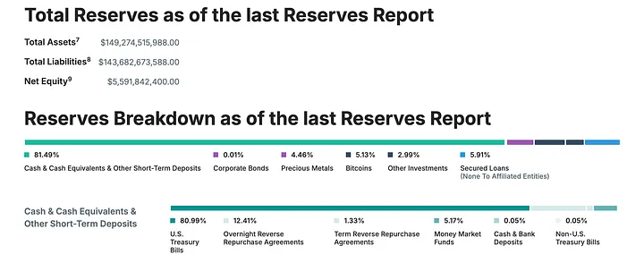
>>>>>>>*USDT’s reserve report*

反觀 USDC，從 2019 到現在其蠻明確就是要走美國體系監管合規的道路，隨著近期的 GENIUS 法案箭在弦上，可以預期 USDC 過去所有的合規努力即將開花結果，反觀即使 Tether 在境外有極大的影響力，一但進到美國境內、或是討論到機構採用這件事情，基本上短時間內都不太可能有他們的局。

因此我認為第二個市場給的 Premium 為「合規 Premium」加上「機構採用 Premium」，單論這點目前其他穩定幣都看不到 USDC 的車尾燈。

## 原因三：GENIUS 法案勢在必行
GENIUS 法案，全名為 “Guiding and Establishing National Innovation for U.S. Stablecoins Act”，核心概念是為穩定幣制定一個全面的「聯邦級」監管框架。此法案最新的更新為於 2025/6/17 參議院以 68 票贊成、30 票反對的票數通過 GENIUS ACT，下一步將送交眾議院進行審議和投票，市場預期在眾議院通過的機率仍非常高，預計會在 7 月份完成立法並由總統簽署生效。

GENIUS 法案之所以對 Circle 極為利好，主要原因是其所提到的規範重點基本上和 USDC 運營的方向一模一樣。一些重點列點如下：

1.  高標準的儲備金要求 — 需有 1:1 比例高品質的流動性資產（現金、短債、Money Market Funds）來完全支持該支付型穩定幣
2.  穩定幣運營商需每個月公開準備金狀況、市值超過 500 億需要有年度會計師審核過的財務報表
3.  支付型穩定幣不得向投資者配息以避免和銀行存款競爭

回到前面提到的點，GENIUS 法案基本上為未來所有穩定幣設定了一個極為清晰、但同時相對高標準的合規框架，而這完全是 USDC 過去 5–6 年努力走的合規道路。因此隨著該法案即將正式執行，USDC 過去努力設下的合規壁壘將為其鋪墊好也許數年的護城河，這也是市場反應如此劇烈的主因之一。

講完了利好，現在來講一下投資 Circle 這間公司本身的幾個風險來平衡報導。

## 風險一：與 Coinbase 之間的緊箍咒
第一個最大的風險便是 Circle 和 Coinbase 之間的「不平等條約」。前面提到，Circle 在 2024 FY 付了約 9 億美金給 Coinbase 作為 distribution 的支出，而這也是 Circle 這個公司淨利潤率比想像中低的主因，而 Circle 會需要付這麼多利息給 Coinbase 是有其歷史原因的。

### Circle 和 Coinbase 的愛恨情仇
2018 年，Circle 與 Coinbase 共同創立了 Centre 聯盟，負責發行和管理 USDC 穩定幣。當時雙方是平等的合作夥伴，共同分擔治理與運營責任，並分享 USDC 儲備資產的利息收入。

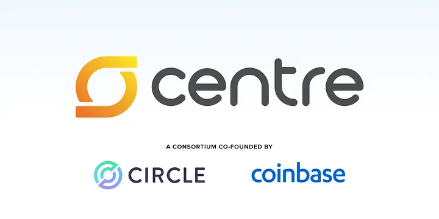

值得一提的是，在當時歷史背景下，實際上穩定幣只是 Circle 其中一個業務，當時他們還有 OTC desk (Circle Trade)、以及 2018 年剛以 4 億美元收購了 Poloniex 這家交易所。然而，隨著 2019 年市場轉熊，Circle 實質上在其他業務是表現極差的，因此最後決定將大部分業務出售，壯士斷腕只保留了核心的穩定幣業務。

2023 年 8 月，隨著 Circle 核心業務轉向穩定幣運營商，Circle 用 2.1 億美元收購 Coinbase 所持有 50% 的 Centre 股份。此次交易後 Circle 取得了 USDC 的發行與治理權，然而天下沒有白吃的午餐， **Coinbase 獲得 Circle 部分股權以及一份分潤合約。簡單來說，Coinbase 能獲得 100% Coinbase 平台上 USDC 所獲得的收益，以及 50% 其他平台上 USDC 的收益。**

### 緊箍咒有多緊
目前 Coinbase 平台上約持有 USDC 20% 的發行量，這 20% 發行量 Coinbase 能獲得 100% 的收益，而剩下 80% 的發行量 Coinbase 也能拿到其收益 50% 的分潤。簡單來說，就目前的情況來看，Circle 實際上約只能賺到其 80% 發行量中的 50% 收益， 也導致了我們在招股書上看到的結果：2024 年即使營收賺了 16.8 億美金，其中必須要付出高達 9 億美金給 Coinbase。

而這個合作條款是 2023 年 8 月所簽訂，期限為三年。然而魔鬼藏在細節裡，只要 Coinbase 達成某特定兩個 KPI （合作協議中並未揭露），合約將自動續約三年，除非一方違約或雙方重新談判。

### Circle 有沒有辦法擺脫這個緊箍咒
首先單就該合作協議的語言讀起來，看起來 Circle 想擺脫這樣的緊箍咒非常困難。如果這樣的假設成立，可以想見即使短債的收益維持在現在這樣的水位，Circle 的淨利潤率仍會因為和 Coinbase 的高額分潤而被不斷拉垮。

另外一個角度去看，Coinbase 為 Circle 的背書的確為其市佔的增長、以及合規的進程有一定程度的貢獻。另外，一個蠻有趣的角度是，GENIUS 法案通過後這些合規穩定幣並不能派息給投資者，但如果**是透過如 Coinbase 這些銷平台去發放呢**？這並非腦洞大開，事實上，現在 Coinbase 正 offer 其用戶，只要存 10 萬美金以下在自己的 perpetual accounts，Coinbase 便會 offer 這些用戶 12% 的年化收益。對於 Circle 而言，隨著監管框架更加清晰，背靠像 Coinbase 這樣有 distribution 的平台也許不失為一個好的策略，我的猜測，戰略上 Circle 高機率也是先且戰且走。

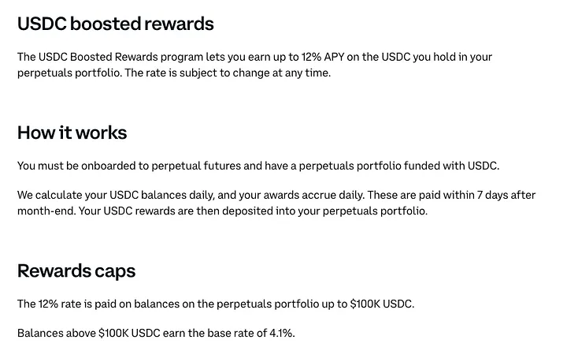

## 風險二：穩定幣儼然為紅海市場，抱團取暖風氣盛行
眾所周知，用穩定幣取代支付、結算場景儼然成為 2025 年這個世界的 Meta，也因此有許多陣營都逐漸成形並想一起吃掉這塊大餅，而伴隨而來的競爭也是 USDC 在未來不得不面對的硬仗：

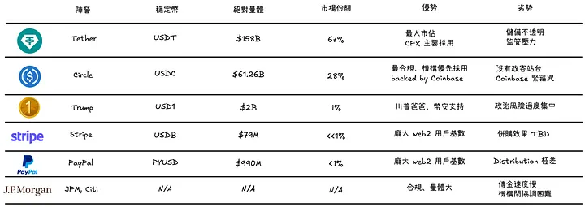

### Tether 陣營 — 最大穩定幣 + 良好政界關係
Tether 不用多說，超過 1500 億的發行量以及超過 60% 市占率，前期透過較不合規的方式快速積累資金，近期也開始往合規之路邁進。陣營陣容堅強，包括 Bitfinex、Cantor Fitzgerald （CEO 為 美國新任的商務部長 Howard Lutnick）、Cantor Equity Partners (CEP，另一家透過 SPAC 上市的 MicroStrategy equivalent)，以及比特小鹿（Tether 持股超過 25% 的中國挖礦平台）。

靠著絕對領先的市占率、日漸合規的儲備，以及逐漸打磨好的政界關係，Tether 仍是 USDC 在穩定幣戰場上最強勁的對手之一。

### Circle 陣營 — 背靠 Coinbase，最合規
誠如整篇文章分析的，Circle 最強的便是合規以及伴隨 GENIUS 法案通過而來的合規護城河。科技公司如 Meta，由於自己無法發行穩定幣，已經開始和 Circle 談合作來在 Instagram 中進行小型試驗，透過 USDC 來做創作者的小額打賞。

### Trump 陣營 — 背靠 Binance，川普家族支持
Trump 家族近期也發行了 USD1，其背靠阿聯的 MGX 主權基金以及幣安，當初 MGX 投資幣安的 20 億美元即是使用 USD1 進行支付。然而 USD1 非常高度和 Trump 綁定，政治風險目前看起來是最大的。

### Stripe 陣營 — 傳統支付巨頭，收購 Bridge, Privy 打造新的場景
Stripe 則是 Web2 payment 巨頭中在近期穩定幣戰爭中最活躍的一個。其在去年底先用 11 億美元收購穩定幣 API 服務商 Bridge，爾後在今年六月又收購了有著 7500 萬用戶的錢包提供商 Privy。其在收購 Bridge 之後發行了 USDB 穩定幣，並目前在 web2, web3 都有著極強的支付應用場景。

### Paypal 陣營 — 龐大用戶基礎
Paypal 早在 2023 年就發行了 pyUSD，並在去年曾透過透過高的派息 (15–20% APY) 來吸引用戶，然而目前總發行量仍在 9 億美元左右，distribution 做得不太好，但仍具有龐大的用戶基礎。

### 美國銀行陣營 — 背靠傳統金融優渥資源，量體龐大
傳統金融的代表，如 JP Morgan, Citi 等大型銀行也組建了聯盟來共同發行穩定幣，其強項在於其本身背靠傳統金融的龐大資源，且有巨大的客戶基數，但傳統金融一向動的很慢，且過去在區塊鏈相關的試點（如 permissioned chain) 的成效也不彰，然而結算仍是一塊傳金必須進來試著吃的大餅。

## 風險三：降息
隨著整體宏觀環境進入降息循環，由於其對利率的原生高敏感度，穩定幣的生意模式絕對是首當其衝會被影響，尤其是「合規」的穩定幣。

對於 USDT 之流，他們還是可以透過持有高風險的資產類別，或是進行比特幣抵押、放貸等業務來賺取額外的收入，但對 USDC 等必須以現金、短天期美債為主要持倉的穩定幣來說，其對利息的高敏感度會極大地影響其收入。

要想規避這樣的風險，其中一個重點是增加 USDC 的 turnover。如 Circle 推出了 Circle Payments Network (CPN) 提供企業跨境結算的服務，這樣生意模式就能從 AUM-based model 轉向 volume-based model，並真正吃到 ACH 的午餐，並極大程度規避其對利率的風險。然而端看 2024 財年 Circle 的收入，仍有高達 96% 的收入是純靠利息收入，Circle 的轉型，以及企業實際在跨境結算的 adoption rate 都還有很長的路要走。

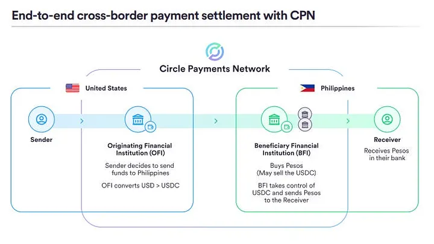

## 結語
身為業界老韭菜，看到傳統金融圈的朋友也開始討論穩定幣，是非常欣慰也 rewarding 的，這代表著我們在這幾年信仰的事情逐漸成真，從目前的 trajectory 看來，反噬回去傳統金融，並將其不效率的部分取代掉這件事情是極有可能成真的。然而，call back 到我通篇的論點，我認為正視並真切認知到 Circle 這家公司本身有的一些風險，再去談 upside 會是更正確的投資方式。

