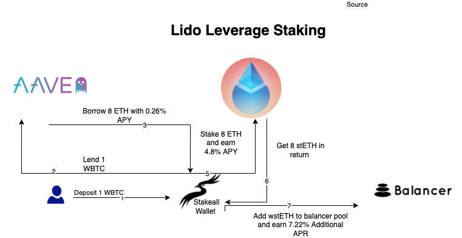
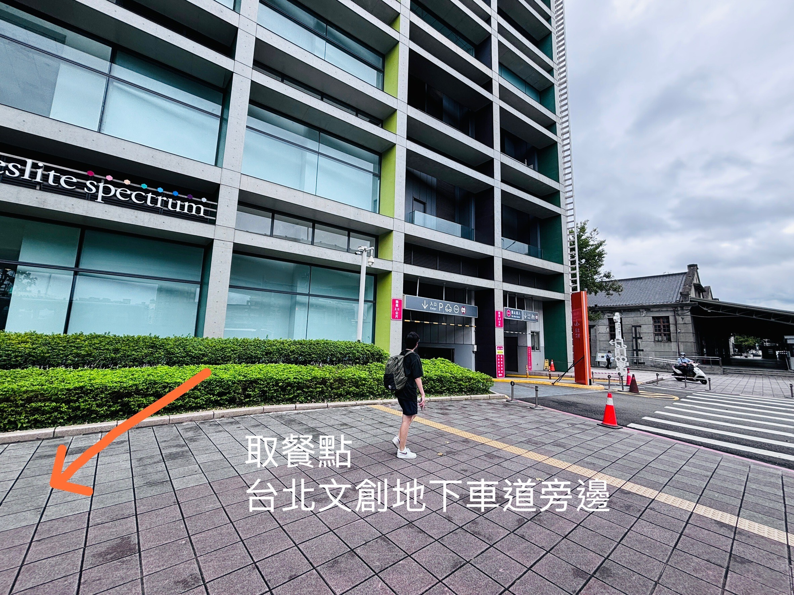

+++
date = '2025-08-10T12:21:30+08:00'
draft = false
title = 'Digital Asset Treasuries （一）起源及入門知識'
+++

在這系列文章中，我將分析 Digital Asset Treasuries (DAT) 公司的核心架構，讓你讀懂 MicroStrategy ($MSTR), Sharplink Gaming ($SBET) 這些公司到底背後運作原理是什麼，以及為什麽我們正在經歷資本市場史上最有趣的金融革命，以及泡沫。

維度三：引入 DeFi 疊疊樂

Crypto 最強的事情一向都是「可組合性」這件事情。拿 $ETH 為例：

第一層是你能夠做 staking 拿到一個 3–4% 的年化收益
第二層是能夠做 restaking — 可以想像成透過質押自己的 $ETH 來幫一些需要信任假設的基礎建設 （Infrastructure）項目背書，從而賺取額外的收益
第三層是還能夠將這些 restaking 後所拿到的 token 再存進 lending protocol, Pendle 等協議再繼續獲得提供流動性的收益，甚至能再借出穩定幣來再買入更多 $ETH，不斷將收益疊高

A simple example of DeFi Lego. Src: Lido
而這不是我在幻想，Solana 上目前最大的 DAT — DeFi Development Corp ($DFDV) 在一場 Twitter Space 中提到，他們的一大策略是將自己手上持有的 $SOL depoly 回 Solana 的 DeFi 生態系，幫助這些 DeFi 能夠更欣欣向榮後，高機率 $SOL 的價格也會因此而繼續上漲，而 $SOL 的上漲又能夠使他們的資產負債表獲益，創造出一種流動性上的飛輪效應。

