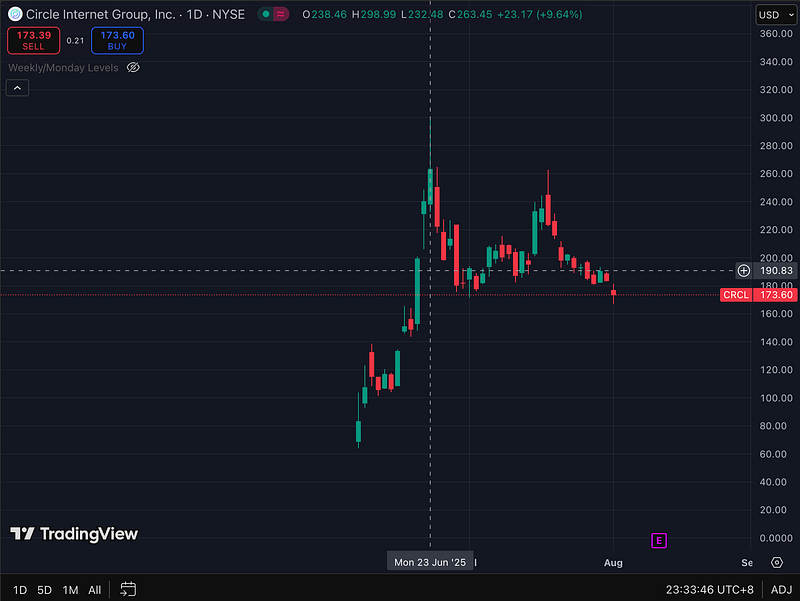
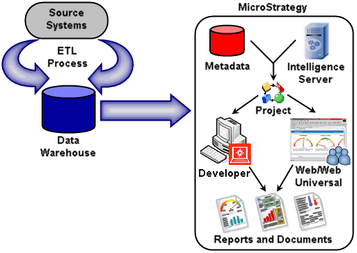
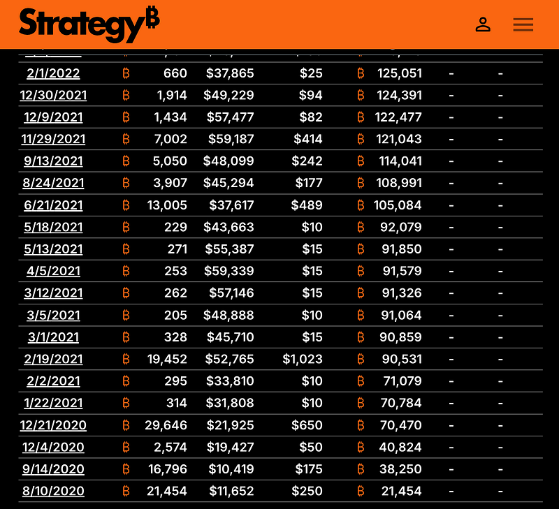
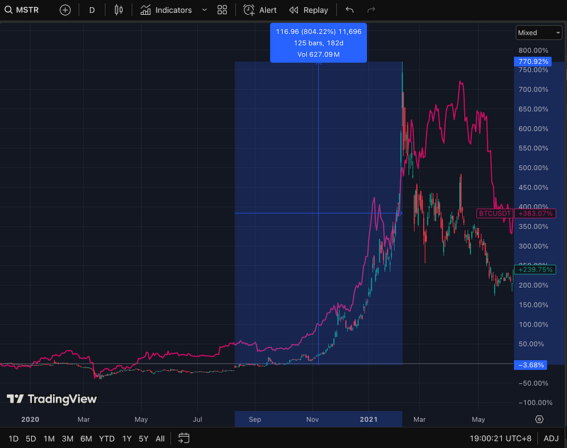
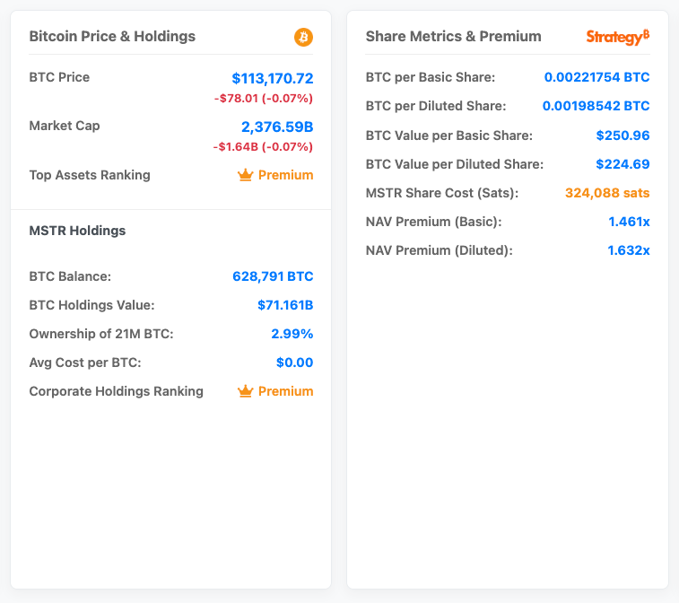
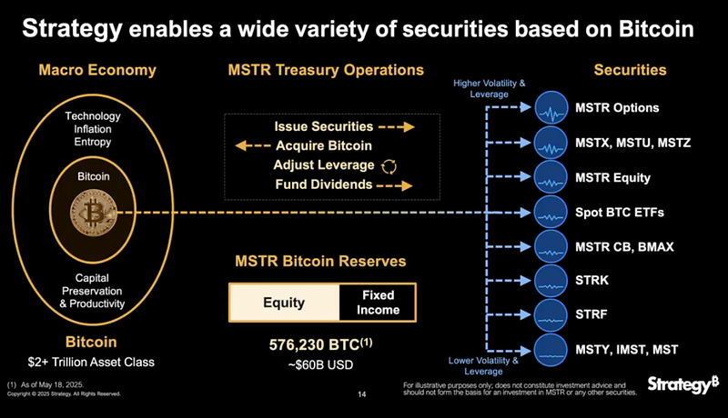
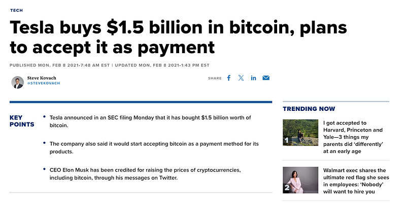
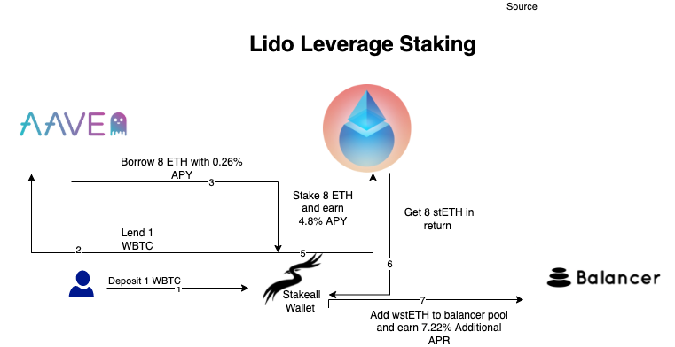

+++
title = "Digital Asset Treasuries （一）起源及入門知識"
date = 2025-08-03T17:56:29+08:00
draft = false
series = ["DAT Series"]
+++

> 在這系列文章中，我將分析 Digital Asset Treasuries (DAT) 公司的核心架構，讓你讀懂 MicroStrategy ($MSTR), Sharplink Gaming ($SBET) 這些公司到底背後運作原理是什麼，以及為什麽我們正在經歷資本市場史上最有趣的金融革命，以及泡沫。

華爾街正在瘋狂擁抱加密貨幣。

六月份寫了 Circle 上市的文章中分析了華爾街是如何重度押注在穩定幣賽道上，文章中我詳細分析了資本市場擁抱 Circle 的主要原因以及風險。

[**Circle ($CRCL) 股價狂漲 7 倍 — 是泡沫還是穩定幣的 iPhone 時刻**](https://johnny-chuang.medium.com/circle-crcl-%E8%82%A1%E5%83%B9%E7%8B%82%E6%BC%B2-7-%E5%80%8D-%E6%98%AF%E6%B3%A1%E6%B2%AB%E9%82%84%E6%98%AF%E7%A9%A9%E5%AE%9A%E5%B9%A3%E7%9A%84-iphone-%E6%99%82%E5%88%BB-8e0a2715e26b)

（題外話，文章發布後 (6/22) 到現在跌了 31%，謝謝市場沒有讓我看起來像個小丑）

與此同時，大量資本也正在湧入另外一股同樣瘋狂的浪潮：那些直接在資產負債表上囤積加密貨幣的公司們，如 MicroStrategy, Sharplink Gaming 等，市場開始給他們一個新的名字：**Digital Asset Treasuries (DAT)**。 

大部分會被歸類為在 DAT 的公司，其不外乎是本業表現不佳的上市公司，或是 2025 年開始有許多直接不演了，透過借殼直接上市開始瘋狂購入不同的加密貨幣資產來作為儲備。有趣的是，這些操作表面上看起來像是市場情緒的瘋狂追價，但仔細研究會發現，這其實是**包含精密財務槓桿、流通股本管理、資本市場運營、甚至政策博弈等多重元素的「金融工程作品」**，是一種結合敘事操作與資本槓桿玩到極致的策略。

這篇文章是我開啟的一個新系列：Digital Asset Treasuries，我將從最基本的歷史講起，並挖掘背後的商業 logique 與財務操作，希望能用最淺顯易懂的方式全面地讓讀者能了解 DAT 背後玩的精妙遊戲。讀完這系列後，我相信你在臉書上看到有人在分享 $MSTR, $SBET 時，能夠冷笑一聲並在內心說：「我早就都讀過了」。

## DAT 的起源及歷史

廣義的 DAT 可以追溯到 2020–2021 年那一波牛市。當時比特幣首次真正進入大眾視野、金融媒體與機構資產配置的討論範圍。那段時期「比特幣作為企業儲備資產」這個敘事開始被少數先行者實踐。而在這些先行者中，最關鍵、也是後續所有 DAT 模型的源頭，就是 MicroStrategy（$MSTR）的瘋狂實驗。

### MicroStrategy：一家本來沒人在乎的 BI 軟體公司

在進入比特幣世界之前，MicroStrategy 是一家典型的老牌 B2B 軟體公司。它成立於 1989 年，主營商業智慧（BI）分析平台，曾是 2000 年網路泡沫時代最炙手可熱的明星。然而，就在最巔峰時，公司被踢爆其財報存在嚴重會計問題，被迫重述營收，從『高速增長』打回『連續虧損』的原形，導致股價單日崩盤超過 60%。

從那一刻起，MicroStrategy 便從雲端跌落凡間，從此陷入了長達二十年的沉寂，變成一家在納斯達克被市場遺忘的二線軟體公司。

直到 2020 年 8 月，執行長 Michael Saylor 突然宣布，公司已用 2.5 億美元購入 21,454 顆比特幣作為資產儲備，並表示「比特幣是現金的替代品」。這一決定在當時看起來極度非典型：對一間不碰金融業務的 SaaS 公司來說，這根本像是把現金流燃掉去賭運氣。

然而故事的走向遠超所有人預期：這只是開端。

### 2020 — ? MicroStrategy 的比特幣實驗

在那之後，MicroStrategy 仍持續買入 $BTC，而隨著市場走入牛市，$BTC 的價格也不斷水漲船高，導致 MicroStrategy 的持有的比特幣越來越值錢。

人們也開始意識到只要比特幣持續上漲， MicroStrategy 這套策略也許能夠達到兩種目的：

1.  提供了一種讓無法 access 到比特幣投資的傳統資本間接曝險的 Instrument
2.  同時這樣的策略也可能是種 self-fulfilling prophecy：MicroStrategy 持續累積比特幣的同時也正在不斷推高其價格，導致其能有更多彈性去使用更多金融工具來進行舉債，近一步購入更多的比特幣

因此，從 MicroStrategy 宣布開始買比特幣後，資本開始湧入 $MSTR，其股價在上個牛市自宣布比特幣儲備到最高點一共漲了八倍。

而自 2020 年高舉比特幣大旗至今，MicroStrategy 的數位黃金實驗已臻化境。截至 2025 年 7 月底，MicroStrategy 以前所未見的狂熱，將超過 **628,000 枚比特幣**納入其資產負債表，總斥資超過 **460 億美元**。以現價計算，這些比特幣的價值已飆升至近 **710 億美元**，堪稱是全球最極端、最引人注目的 BTC Treasury 模型。

*src: [Strategy Tracker](https://strategytracker.com/mstr/?charts=nav-multiplier%2Cperformance-comparison%2Cbitcoin-price%2Cperformance-nav-premium%2Creserve-chart&timeRange=year)* 

暴雷一下接下來文章的重點，MicroStrategy 的本業是一個極度不賺錢的 SaaS 服務，因此其從來不是「用盈利買幣」，而是將金融工程的藝術發揮到極致，**把市場對比特幣的信仰直接轉化為不斷加碼的槓桿。** 從 2020 年到 2025 年，MSTR 的整體操作如下：

* 持續發行**數十億美元的可轉換公司債**與**優先擔保票據**。
* 透過「At-The-Market (ATM)」計畫，大規模增發股票，僅 2025 上半年就募得超過 **100 億美元**資金。
* 創新地發行與比特幣掛鉤的**優先股（如 STRC）**，進一步從資本市場吸金。

這一切操作，都是以極低、甚至是零利率的融資成本，換取真金白銀的比特幣現貨頭寸。

整套劇本的內核邏輯依然粗暴而有效：只要資本市場願意為其 BTC 敘事買單，就能源源不絕地透過發行新資產、舉債來購入更多比特幣。增加的比特幣儲備推高了公司的估值與股價，從而賦予你發行更多資產的權力。這就是那個被稱為「**信仰-估值-槓桿飛輪**」的金融怪物，至今仍在全速運轉，而且越滾越大。

### 2021 科技巨頭的嘗試：Block、Tesla 短暫跟風

在 $MSTR 打開第一槍之後，2021 年也有幾間大型科技公司短暫踏進比特幣 Treasury 的世界，引發市場無限遐想。較為人知的例子包括：

1.  **Square (現 Block, $SQ)**：2020 年 Q4 購入 5,000 顆 BTC，並在財報中明確表示此為企業策略性儲備資產。
2.  **Tesla ($TSLA)**：2021 年 2 月宣布購入 15 億美元比特幣，一度將 BTC 作為可用於買車的支付方式，但後續即因 ESG 與稅務考量部分賣出。

這幾次短暫的插花最終都未能延續。原因也很簡單：這些公司的核心業務依然仰賴穩定的現金流與可預測的財報。比特幣上沖下洗的劇烈波動，對財務表現的干擾猶如一顆定時炸彈，讓追求穩健的董事會和投資人難以忍受。

#### 2021–2023 挖礦公司的轉型

在上個牛市，真正能稱得上延續 MicroStrategy 的比特幣儲備路線的反而是原本就身處在比特幣產業鏈核心的上市礦商。傳統礦工的生意模式很單純：挖提賣，本質上是在用「低電價、規模化礦場」來套利持續挖出比特幣所獲得的報酬。但這些礦商紛紛於 2021 年開始宣布將停止出售挖到的比特幣，並也開始透過帳上現金、公開市場舉債來購入比特幣。

以 $MARA 為例，截至 2025 年中，其持有超過 **50,000 顆比特幣**，成為全世界持有比特幣數量第二多的上市公司（僅次 MicroStrategy）。大部分來源為自挖與策略性市場購買。這些公司逐漸將 $BTC 視為資產與資本操作的組合槓桿工具，用 NAV（Net Asset Value）敘事來構築估值底層。

### 2024–2025 進化形態：借殼、槓桿、萬物皆可 DAT

如果說 MicroStrategy 開創的 $BTC Treasury 是 DAT 1.0，那麼 2024–2025 年的市場，則上演了一場令人目眩神迷的物種大爆炸，DAT 的遊戲架構與內核都已從多個維度徹底進化：

**維度一：玩家入場路徑的改變**

過去的玩家多是已上市公司（如 $MSTR、$MARA）的「策略轉型」，而新一波的挑戰者則更加赤裸（不演了）：它們選擇了「**借殼上市**」這條快速通道。這些新創公司不再背負任何舊有業務的包袱，它們從成立第一天起，唯一目的就是成為一個**純粹的、在公開市場上交易的加密資產載體**。它們透過反向併購（RTO）取得上市公司的乾淨軀殼，直接面向資本市場進行募資，其商業計畫書只有一行字：**用你的錢，買幣，然後讓估值飛輪轉起來。**

> **知名例子如由 Tether （USDT 發行商）所扶持出的** Twenty One Capital ($XXI)。

**維度二：底層資產轉向山寨幣**

隨著做比特幣儲備的 DAT 越來越多，許多 DAT 公司開始轉向購入 $ETH, $SOL 等市值排名靠前的加密資產。這兩種資產和 $BTC 相比，最大的優勢在於其本身為 PoS 共識機制，因此持有更多 Stake 並質押，這些 DAT 公司本身能夠賺取約 3–7% 的 native staking yield，比起單純購入比特幣，這樣的操作能夠創造穩定以加密資產計價的現金流。

> **購入 $ETH 的 DAT: 如 Sharplink Gaming ($SBET)，目前持有超 480,000 $ETH (~US$ 1.66B)**
> **購入 $SOL 的 DAT: 如 DeFi Development Corp ($DFDV) ，目前持有超 1.18M $SOL (~US$ 192M)**

當然，會搞事的 Crypto 項目也不能浪費這個能夠 access 到傳統資金的機會：知名穩定幣項目 Ethena 也宣佈自己的子公司 StablecoinX 將透過 SPAC 來上是，並已經募集了 US$ 360M 來購入 $ENA 作為該公司的加密資產儲備。

除了 Ethena 之外，小道消息是四爺 CZ 趙長鵬也正在為自己的 $BNB DAT 募集資金準備上市，2025 年正式成為「萬物皆可 DAT」 的年份。

**維度三：引入 DeFi 疊疊樂**

Crypto 最強的事情一向都是「可組合性」這件事情。拿 $ETH 為例：

1.  第一層是你能夠做 staking 拿到一個 3–4% 的年化收益
2.  第二層是能夠做 restaking — 可以想像成透過質押自己的 $ETH 來幫一些需要信任假設的基礎建設 （Infrastructure）項目背書，從而賺取額外的收益
3.  第三層是還能夠將這些 restaking 後所拿到的 token 再存進 lending protocol, Pendle 等協議再繼續獲得提供流動性的收益，甚至能再借出穩定幣來再買入更多 $ETH，不斷將收益疊高

*A simple example of DeFi Lego. Src: Lido*

而這不是我在幻想，Solana 上目前最大的 DAT — DeFi Development Corp ($DFDV) 在一場 Twitter Space 中提到，他們的一大策略是將自己手上持有的 $SOL depoly 回 Solana 的 DeFi 生態系，幫助這些 DeFi 能夠更欣欣向榮後，高機率 $SOL 的價格也會因此而繼續上漲，而 $SOL 的上漲又能夠使他們的資產負債表獲益，創造出一種流動性上的飛輪效應。

## 簡單點評 — DAT 到底在玩什麼遊戲？

在接下來的系列中我會更深入的解釋這些概念並給出一些實際的 case study，但在第一篇文章，想要先給出我目前的結論：

DAT 玩的是一場精心設計的多層次資本遊戲。其成功的核心劇本，可以拆解為四個環環相扣的關鍵要素：

### 底層：DAT 必須押注在長期上漲且具有稀缺性的資產

這是一切的起點。如果底層資產不具備強大的共識、稀缺性與長期增長潛力，那麼後續一切的金融工程都只是蓋在沙灘上的城堡。這也是為什麼遊戲的起點往往是 $BTC 或 $ETH。

從基本教義的角度出發，我個人認為 $ETH 並不具備稀缺的特性，但其內含 PoS 所帶來的收益所創造出來的現金流，此消彼長之下，值得關注 $ETH 長期而言是否能被當作一個 DAT 的底層資產。

### 引擎：波動率套利

DAT 最關鍵的操作是其能夠長期透過非常低的利息獲得資金並持續買入儲備資產。而這源頭來自於其和 $BTC, $ETH 的風險性資產的掛鉤導致的高波動率，進而導致其所發行的可轉換公司債隱含的 Call Option 價值非常高。本質上，DAT 是將自身股價的高波動性這個缺點，轉化為向市場兜售選擇權的優點，以此換取近乎零成本的巨額資金。

### 強化：Premium Game

當市場辨識出這套獨特的、帶有槓桿的資產獲取模式後，便願意給予其高於淨資產（NAV）的估值溢價。這場 Premium Game 不僅是中後期的獎勵，其本身也成為吸引更多資本的護城河。

### 頂層：開場外槓桿來創造自我預言的場景

最終，透過「波動率套利」取得的廉價槓桿，被用來持續購入稀缺的底層資產，進一步推高 NAV 與市場的想像力，從而鞏固了股價的 Premium，並賦予公司發行更多廉價槓桿的權力。

> **這四個要素既為因也為果，既可以說其缺一不可，彼此之間又互相成就了對方，DAT 始於對資產的信仰，以金融槓桿為燃料，最後在資本市場上實現的價值的自我增強。**

在接下來的系列文章中，我將帶大家持續細細研讀並品味這背後的原理。