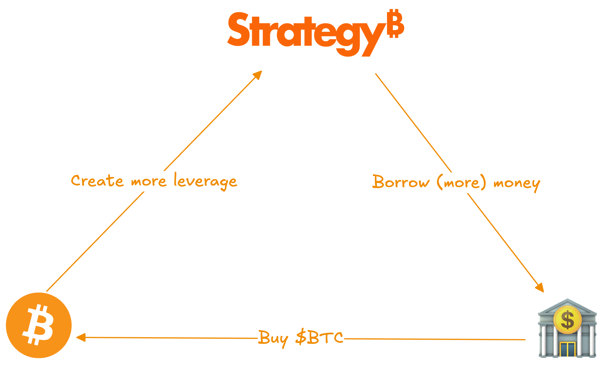
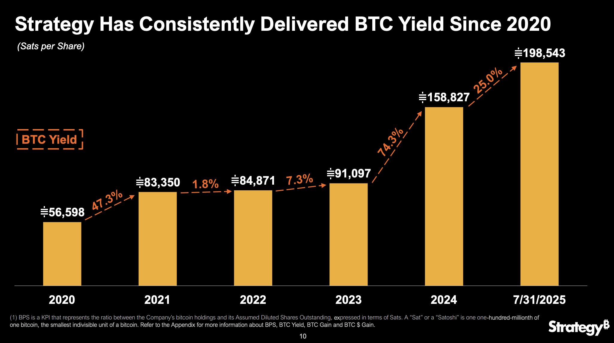
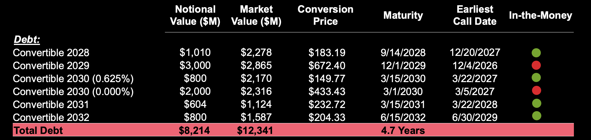
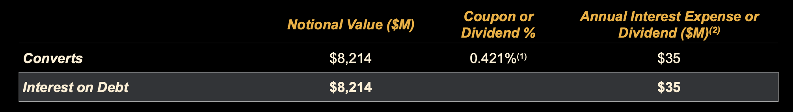
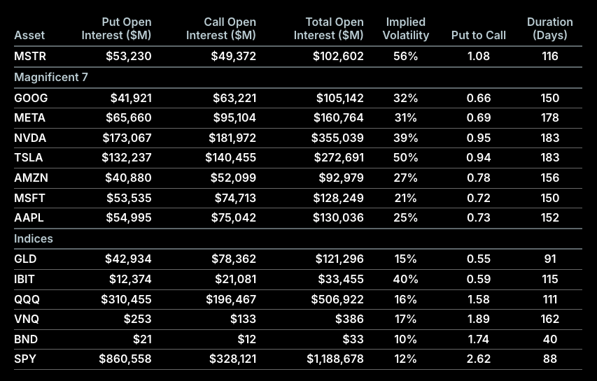
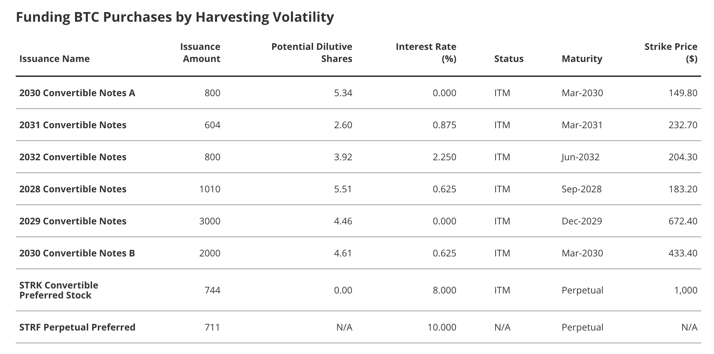
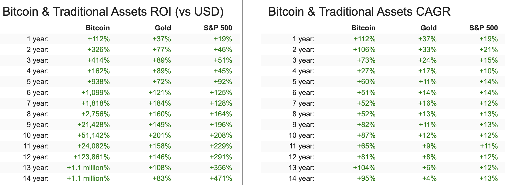

+++
title = "Digital Asset Treasuries （二）MicroStrategy 的可轉債及特別股"
date = 2025-08-14T11:56:29+08:00
series = ["DAT Series"]
draft = false
+++

在上一篇文章中，我們討論了 DAT 的歷史以及其演化，並在結尾處我們總結了 DAT 玩的核心遊戲。

接下來，我們將細細拆解最引人注目，也是最成功的 DAT 代表：MicroStrategy ($MSTR)，是如何透過金融工程創造出比特幣的永動機。在這篇文章中，我們將解釋 MSTR 融資的三大手段中的其中兩個：**發行可轉債及特別股。** 

## MSTR 的商業模式簡述

首先，MSTR 的「商業模式」非常簡單粗暴，簡單畫圖表示如下：

基本上三個動作：借錢、買比特幣，創造出更多 Leverage on capital market。

買比特幣本身只是一個簡單的操作，這套模式真正的重點在於「錢從哪裡來？」以及「槓桿是如何被創造的？」。

## MSTR 的唯一目標

MSTR 的 Founder Michael Saylor 為 Strategy 創造出了一個很有趣的名詞：BTC Yield（比特幣收益率）。BTC Yield 和我們熟知的 DeFi 收益率定義不同，Michael Saylor 的定義為「在單位時間內，每一股 MSTR 所持有的 $BTC 的變化量」。

**而 MSTR 的唯一北極星、唯一使命，就是持續為股東持續創造出 BTC Yield**。

舉例來說，假設一年前每股 MSTR 股東算下來平均持有 0.1 個 $BTC，到了今天平均每股變成 0.2 個 $BTC，在 Saylor 的定義裡面，**這一年 MSTR 的 BTC Yield 即為 100%**。要打個比方的話，我認為概念類似從**幣本位**思考的收益率。

但請先記住這個概念，因其將貫穿整篇文章，以及 MSTR 整間公司做的所有事情：

***「MSTR 所做的一切都是為了創造持續性的 BTC Yield」。***

>>>>BTC Yield 的概念貫穿整個 MSTR earnings call 

## 發行 Convertible Bonds

拉回到我們上面提到的兩個問題：錢從哪裡來，以及槓桿如何被創造及被市場接受。

關於錢從哪裡來，許多人直觀會認為 MSTR 就是單純地去銀行或市場上借貸，對也不對，MSTR 的第一個殺招是發行多層次的 Convertible Bonds (CB)。

註解：Convertible Bond 的中文叫做可轉換公司債，投資者將資金借給公司，公司承諾在未來償還本金加上利息之外，投資者還有權利用一個預定好的價格 (Strike Price) 轉換自己的投資額為公司的股權。對投資者而言，這提供了「下有保底（債券本金），上不封頂（股票上漲潛力）」的優勢。

如上圖所示，我們可以看到每個 CB 都有其當時訂定的 Conversion Price (投資者能以什麼價格轉換成 MSTR 股票)，以及 Maturity （到期日）。針對這樣的債務結構，有幾件事情可以分析及補充：

1. MSTR 的 CB 最快會在 2028 年以後到期，但其可以透過發行不同 Maturity 的 CB 來減緩到期壓力，並透過借更長的債來償還短期的利息以及到期債（必須償還本金或承受轉換成股權所帶來的股本稀釋）
2. MSTR 的 CB 為半年定期支付一次利息
3. 大部分 CB 其實是 in the money，代表目前股價比當時訂定的 Conversion Price 還要高，因此對這些投資者來說轉換成股權是理性的決定
4. 表上沒有完全列出，但實際上 MSTR 目前所發出的 CB 利息都非常低，最貴的是 2032 的 CB 有著 2.25% 的借款利率，但整體來說，**其共計 US$ 8.214B 的 CB，總共的 weighted-average interest rate 為 0.421%** 

### 為什麼機構願意用這麼低廉的利息借錢給 MSTR?

很自然會產生的下個問題是，為什麼有機構願意用這麼低廉的利率來借錢給 MSTR？

而答案是 **「MSTR 隱含波動率所帶來的 Premium 價值」**。如上述，CB 是一個買權 (call option) + 債券合體的 instrument，而 MSTR 因為其直接掛鉤 $BTC 所帶來的超高波動率 (30-day vol = 52%, 1Y vol = 91%)，導致其買權部分非常有價值，反觀市場上那些低波動的龍頭公司，例如 AAPL, GOOG 等，即便它們發行 CB，其內含的買權價值也遠不如 MSTR 來得誘人，因此它們需要提供更高的票面利率，才能吸引到買家。

**更有趣的是從 aggregated data 看來，MSTR 的 CB 買家高機率多為專業的套利基金，** 透過購買高 implied vol 的 CB 來和其他衍生品交互操作進行套利。一些能夠側面佐證的數據像是：

- MSTR 的做空比例相當高，其 Short % of Float 約為 8.5%，這個數值約為 $TSLA 的 3.2 倍，以及 $AAPL 的 12 倍
- MSTR 的 options market 超級活躍：Google 的市值約為 MSTR 的 15 倍，但兩者的 Open Interest 數字非常接近。

### 發行 CB 的小結：販賣波動率

要想一言以蔽之來總結 MSTR 籌錢的第一種方式，發行 CB 的話，我會說是在販賣波動率。因為其和 $BTC 掛鉤的特性，MSTR 能夠以非常低的利率取得資金（weighted-average 一年約 0.4% 的利息支出）。在 MSTR 能夠不斷透過發行低利息 CB 籌到新的本金的理想前提下，0.4% 的利息根本不算什麼。而本金部分，可以拆解成兩種狀況：

1. CB 的 call option 最後 ITM（代表 $MSTR 價格上漲），CB 轉換成普通股，導致 BTC Yield 在一開始先上升，但數年後 CB 轉換時再下降
2. CB 的 call option 最後 OTM，MSTR 必須償還本金，但能夠用其他 maturity 的長債來償還這些本金

第一種情況是最理想，也是在這個永動機持續運作下較可能會發生的。在這個情況下，回到比特幣收益率的本質計算，發行 CB 本質上允許 MSTR 在價格相對低點時增加分子（公司持有的 $BTC 數量），因此短期內會先創造漂亮的 BTC Yield，而日後再稀釋流通的普通股股數。在接下來的篇幅中我們還會討論到更深層的問題：假設 $BTC 真的漲上去，「比特幣收益率」將越來越難創造。

## 發行特別股

第二種募資方式是發行特別股。MSTR 目前發行了兩種不同性質的特別股，分別為 $STRK 和 $STRF。

### $STRK: 永續 8% 債券 + 永續深度價外買權

$STRK 是一種可轉換特別股，其包含以下幾個特性：

- **高額股息**：它提供高達 **8%** 的年股息，可以選擇用現金或公司普通股來支付 。
- **永久選擇權**：它附帶一個將其轉換為 MSTR 普通股的買權，且這個選擇權沒有到期日，因此沒有時間價值損耗（theta decay） 。
- **極高的轉換價**：然而，這個轉換權的行使價格被設定得非常高（$1000），是 MSTR 現價的 2.6X 左右 ，屬於深度價外（deeply out-of-the-money） 的買權。

### $STRF: 永續 10% 債券

$STRF 則是一種更純粹的「非可轉換特別股」 ：

- **更高的股息**：它支付高達 **10%** 的年股息 。
- **無轉換權**：它**完全沒有**轉換成 MSTR 普通股的權利 。投資者無法分享任何 MSTR 或比特幣價格上漲所帶來的好處 。
- **受信用風險影響**：它的價值主要由市場利率和 MSTR 本身的信用利差所驅動 。如果比特幣價格暴跌，將會損害 MSTR 的償債能力，進而擴大其信用利差，導致 $STRF 的價值下降 。

這兩種特別股的設計更像是 Perpetual Bonds 的概念，其中 $STRK 會包含一個深度價外的買權來讓持有者有一些 upside，但主要吸引到的 TA 會更偏向是偏好固定收益，市場上另一群投資人。

>>>>> Table of MSTR debt related instruments 

很有趣的是，其實這類型永續特別股的概念在傳統金融中並不罕見，美國許多大型銀行都有發行類似的永續特別股，如 BoA, JPM 等等，台灣也有富邦金發行的富邦金甲特 (2881A) 等，但主要這些永續特別股的發行目的都是為了調整資本適足率，而 MSTR 算是劍走偏鋒將這樣的防守型操作轉為攻擊型。

我的認知中，其主要在賭的是兩件事：

1. 使用永續特別股募資本質上對 BTC Yield 百利而無一害，分子增加，分母大部分情況下並不會被稀釋（除非 $STRK 的深度價外買權變成價內）
2. 我給你美金計價一年 10% 利息，但我拿你的錢去買 $BTC，一個價格在過去十年 CAGR 87%，過去五年 CAGR 60% 成長的資產，只要 $BTC 長期仍能跑贏 10% 的 CAGR 做這件事就合理。

*註：2025/6 MSTR 發行了第三種特別股 $STRD，本質上和 $STRF 幾乎一樣，差異只在於股息不可累積，以及清償順位較低，本質上還是屬於永續特別股的一種 class，故不多花篇幅解釋。*