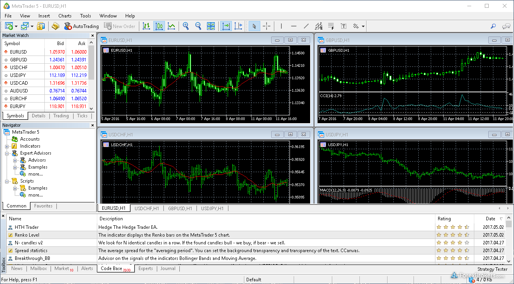

+++
title = "HIP-3: Democratization of Crypto Brokers"
date = 2025-11-26T19:45:36+08:00
draft = false
series = ["Crypto"]
description = "Exploring Hyperliquid's HIP-3 and the democratization of crypto brokers: Shifting from liquidity-as-a-service to infrastructure-as-a-service."
+++

Here are my immediate thoughts after digging into HIP-3. I think HIP-3 is a brilliant move to challenge the many centralized exchanges out there that have zero differentiation. Before this, Hyperliquid was running a **“liquidity-as-a-service”** playbook; now, they are shifting to **“infrastructure-as-a-service”** to expand their offerings (and defensibility).

First, let’s recap what HIP-3 does: 

HIP-3 represents **Builder-deloyed Perpetuals**. The deployer needs to stake 500K HYPE (~$15M) as provided economic security to the ticker. They also need to set the oracle definition, leverage limits, and market settlements, basically managing the market, and in return they get to keep 50% of the total trading fee. 

To date, we’ve seen some players like [@tradexyz](https://x.com/tradexyz) and [@Felix](https://x.com/felixprotocol) have deployed several US equity trading pairs using HIP-3. The flagship pair was XYZ, got ~$300M daily trading volume in the last 24h. You can see Hyperliquid is going quite serious about it as they kicked off the growth mode, which lowered the trading fees by 90%. 

This framework actually reminds me back to the Forex trading days. In Forex, the most-used trading brokers are MT4 and MT5, they are different versions of software developed by MetaQuotes, a Russian software company. 

In different local markets, you’d have different white-label brokers setting their own orderbooks and trading pairs, but backends they use the same MT4 infra and EAs (Expert Advisors, similar to trading scripts). 

Before crypto days, Forex trading in Chinese speaking countries was crazy, and there were probably hundreds of, if not thousands of small local brokers getting users literally on the ground through very localized groups and workshops. That grassroot approach is what got MT4, MT5 successful and well adopted in the world and helped them win the market shares of retail market. 

Back to Hyperliquid, HIP-3 is the same play, where Hyperliquid here is comparable to MT4, MT5, and the deployers of HIP-3 are essentially brokers, who own the autonomy to set up the market the way they prefer, while leveraging the trading infra that Hyperliquid has built out. Essentially, you can think of each of them as if they are running a small exchange themselves. 

Before HIP-3, this was not possible as building out a battle-tested trading infrastructure is very costly, it can easily cost you tens of millions, if not more, this overhead is why many people got cold feet, not to mention even if you spent that amount of money you can still get hacked and stuff. That excludes many brokers that actually have the ability to list and manage interest markets with their domain knowledge. 

But now with HIP-3, we can expect these brokers/deployers to work their magic. 

US equity is ofc the low-hanging fruit here, which apparently @tradexyz is doing an amazing job. 

We’ve also seen people from [@TroveMarkets](https://x.com/TroveMarkets) who know collectibles (which is also a very interesting & large market) ready to launch interesting perps like $POKE, $ZARD. 

Of course, right now the overhead of staking 500K $HYPE is still a lot, most deployer does not have that money. Silver lining here is that 

1)The cost is expected to go down gradually 

2)$HYPE LST/vault product can potentially solve this (which I’ll cover in the next piece) 

In short, I’m very bullish that HIP-3 will unlock the many different instruments on Hyperliquid, and the endgame seems clearer and clearer now:

They are the best liquidity layer for crypto assets already, now they are expanding to be the best liquidity layer for **all assets** with the democratization of brokers.