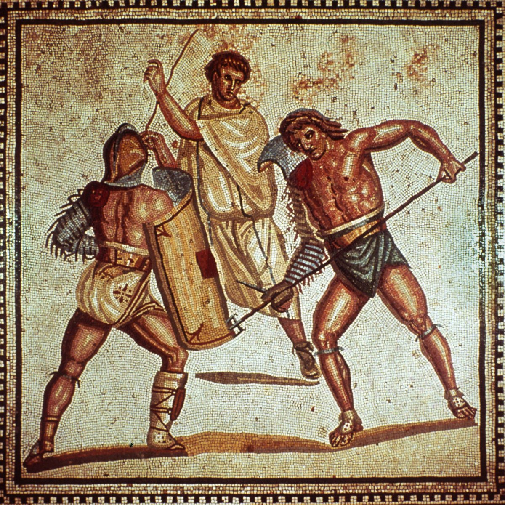
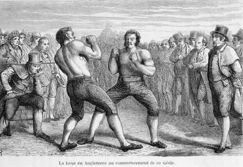
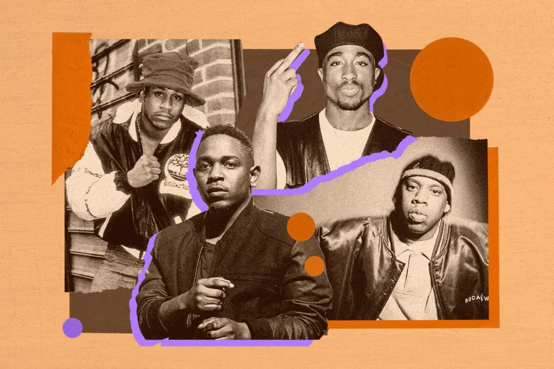
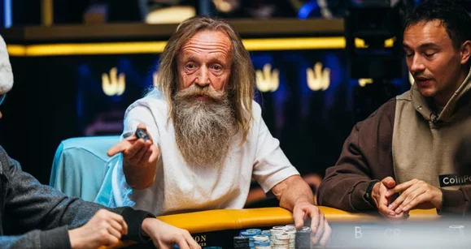
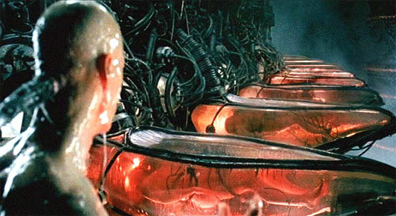
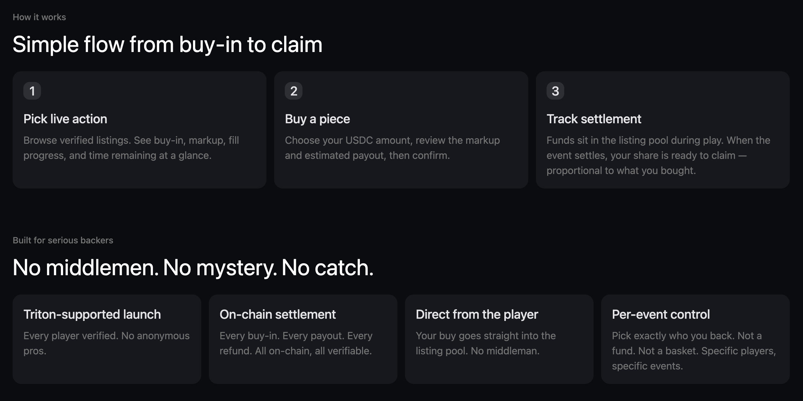

[@JupiterExchange](https://x.com/@JupiterExchange) just launched Jupiter Poker. At face value, it's easy to dismiss this as just another RWA product in a long line of "we're putting X on-chain" announcements.

But I think that framing misses the point entirely.

What I actually see is a much bigger idea quietly buried underneath — one that's been in the making for centuries, and one that blockchain infrastructure is uniquely positioned to unlock: the tokenization of human capital.

---

## A Brief History of Buying Into Human Potential

The idea of financially backing another person's future output isn't new. In fact, it's one of the oldest economic primitives in existence.

In ancient Rome, the *lanista* — a gladiator trainer and promoter — would purchase, train, and lease out fighters to arena organizers. Wealthy Roman citizens would back these gladiatorial schools as investment vehicles, effectively buying fractional stakes in a pool of human performance.

Then there's 18th-century English prizefighting. Long before boxing had governing bodies or sanctioned title fights, the sport ran entirely on a private staking economy. A wealthy backer (often a nobleman looking for both sport and profit) would fund a promising fighter: paying for his training, his lodging, his travel to the fight, and crucially, the stake money put up as a financial guarantee for the bout. In return, the backer received a negotiated share of the prize purse if his fighter won. The Pugilistic Club, founded in London in 1814, was essentially the first formalized version of this: a consortium of aristocratic backers creating structure around what had previously been purely informal arrangements.

More recently, record labels perfected this model in the 20th century: front a promising artist with a recording advance, own a slice of their future royalties in return. The artist gets capital to operate; the label gets upside on their career trajectory. ISA programs at coding bootcamps, sports agents negotiating signing bonuses, Hollywood studios locking actors into multi-picture deals — all variations on the same theme.

**The underlying economic desire has never changed.** What has always held these markets back is the plumbing.

---

## Why These Markets Have Always Been Broken

Every historical version of human capital trading shares the same structural weaknesses: information asymmetry, settlement friction, and counterparty risk.

You're buying into someone's future performance. The seller knows far more about their own ability than you do. Actually getting your cut of the upside depends entirely on the integrity of the person you backed. There's no neutral enforcement layer; if they walk away, your only recourse is a lawsuit, a handshake agreement, or a prayer.

This is why these markets have always been captured by middlemen. Someone has to absorb and manage the trust problem (brokers, agents, labels, studios), and they extract their fee accordingly.

But what happens to these markets if you remove the trust assumption entirely?

If every party could transact knowing that the settlement terms are already locked in, that the funds are already escrowed in a verifiable contract, that the payout is automatic and proportional the moment the outcome is confirmed, you'd push the market meaningfully closer to an equilibrium state. The person who deserves capital access can get it more easily. The person who can correctly evaluate talent can invest more efficiently. The middlemen who existed solely to manage counterparty risk get structurally disintermediated.

A blockchain isn't the only way to approach this, but right now it's the best infrastructure we have to make that kind of trustless, instantaneous, globally accessible settlement a reality.

---

## Walk Through Poker First

Going back to Jupiter's new product, why poker first?

My take is, professional poker staking is THE most established, and ironically the most chaotic, example of this kind of human capital market.

### What is Poker Staking

Depends on the level, an excellent poker player can expect an average ROI of 15-25% of his buy-in. When one of them registered for a $100,000 buy-in tournament at Triton, he might not want to put up the full amount themselves. Instead, they'll sell fractions of their "action" to backers. A backer might pay $11,000 for 10% of the player's tournament equity. If the player wins $1,000,000, that backer collects $100,000.

The price of a stake is usually sold at a markup. A markup of 1.1x means you're paying $11,000 for what is nominally $10,000 worth of equity. Markup typically ranges from 1.05x to 1.15x, and the number is determined by two things: how good the player actually is, and how confident they are heading into this specific tournament.

**Why do even the best players sell action in the first place?**

Because poker is one of the highest-variance games in existence, and tournament poker amplifies that variance to an almost absurd degree. A single major tournament might take 40, 60, sometimes over 100 hours to play out, and even then, that's a single data point. A player with a genuine statistical edge over the field might still expect to final table a given event only once every 15–20 attempts.

Sometimes, you get a "bad beat" — you might lose to a hand you had completely dominated, at the worst possible moment.

Even the most elite professionals operate in a reality where a six-month downswing is statistically unremarkable. Given this, selling action serves two critical purposes:

1. **Keeping the bankroll healthy.** Playing a tournament that represents 5–10% of your net worth in a single shot is a fast path to going broke even if you're a long-term winner. Selling a portion of your action brings that exposure down to a manageable level.

2. **Invoking the law of large numbers.** The more volume you run across more tournaments, more events, more buy-ins, the faster your true edge manifests in your actual results. By selling stakes and freeing up capital to play more events simultaneously, a player is essentially compressing their variance curve. They're trading upside for sample size, which in a game this swingy is usually the rational move.

The system, in theory, is elegant. In practice, it's been an absolute mess.

---

## The Problems of Poker Staking, and Jupiter Poker

How staking actually works today: there's no central platform, no standard contract, no regulated marketplace. A player who wants to sell action for an upcoming tournament will typically post in a private Telegram group or WhatsApp chat, share a Google Sheet with their proposed terms (buy-in amount, markup, percentage available), and collect payment via bank transfer, Venmo, or crypto sent directly to a personal wallet. Backers wire money based on nothing more than a screenshot and a reputation. Platforms like StakeKings have tried to bring some structure to this, but they function more as directories than enforcement mechanisms — the actual trust still lives entirely with the player.

Applying the three problems from earlier to poker staking:

- You don't really know the player's true long-term ROI **(information asymmetry)**
- Payout is done through whatever manual process the player chooses **(settlement friction)**
- You might get scammed **(counterparty risk)**

Jupiter offers a solution that addresses all three, through blockchains. All players on the platform are verified by Triton — you know exactly who you are backing and their track records are guaranteed. Settlement is through USDC on Solana: you receive the proportional payout as soon as the tournament is concluded from a vault. No manual calculation, no waiting on a wire transfer, no trusting anyone to do the right thing.

---

## This is Just The First Step

I play poker myself, and I've seen this market's chaos up close. Staking arrangements made over Telegram, markups that feel arbitrary, payouts that show up weeks late if at all. The frustration is REAL.

So personally I think poker is the right first market for this because it's quite clearly defined. Tournament results are public, timestamped, and verified by an organizing body. The staking culture is already deeply embedded and the audience — both players and backers — are comfortable transacting in crypto already.

But poker is a proof of concept, not the endgame.

The same financial primitive — backing a person's future output in exchange for a share of the upside, settled automatically through a trustless contract — applies almost anywhere human performance generates verifiable, measurable outcomes. Esports players selling tournament action. Independent musicians pre-selling a percentage of their next album's streaming revenue to early supporters. Competitive athletes funding their training seasons by offering backers a cut of prize money and endorsement deals.

This also links to what crypto has always been missing: a deep supply of genuinely good assets to trade on — things with real underlying outcomes, real fundamentals, real non-correlation to BTC price. Tokenized human capital is exactly that. These are outcomes determined by skill, preparation, and variance — not macro sentiment. Bringing them on-chain adds an entirely new asset class to the global speculation stack.

I know, I know — many people tried that in 2021 with fractionalized NFTs. But most of them failed for two reasons: they only built out the tech without finding demand hard enough, and the adoption wasn't ready.

We're now at the inflection point where stablecoin adoption has been meaningfully high enough to bring this experiment back. And with a brand like [@JupiterExchange](https://x.com/@JupiterExchange) behind this, little doubt on their ability to pull it off on the GTM side.

Let's see where it leads.
