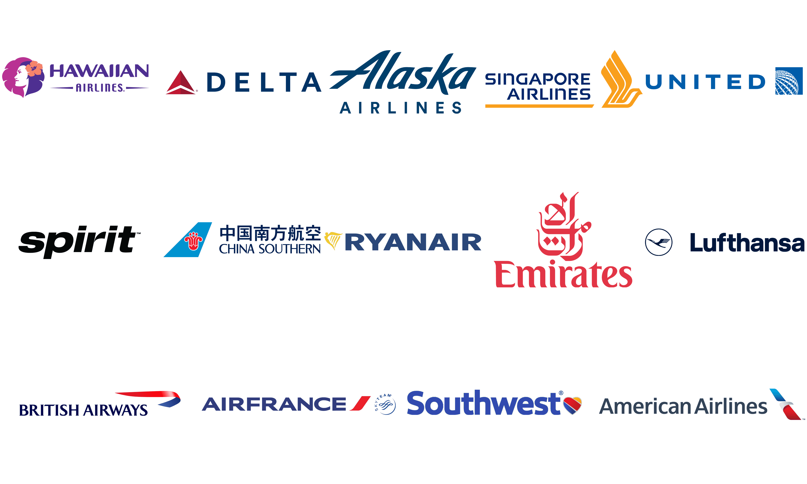

For the longest time, I told myself my obsession with startups and venture capital was just my ADHD-addled brain wanting to be cooler than everyone else in my early 20s. But about a year ago, I realized that was bullshit. My real passion is figuring out how money ***actually*** moves and how people build business models that are borderline genius in their deception.

I’m talking about the **contrarian** hustles. The ones where you use a service every day, thinking you know the deal, only to find out their main business is something else entirely. I live for that ***"oh, you clever lil bitch"*** moment of realization. The most famous example is the one that started it all: the razor-and-blades model.

Gillette famously sold the razor handle at **little to no profit**, while the replacement blades carried margins as high as **40-60%**. HP followed the same approach with printers, which can be bought for under US$ 100, but a set of ink cartridges often costs US$ 30 to US$ 40, making the cost of ink per page more expensive than vintage champagne. Nespresso built a multi-billion dollar business the same way, with machines frequently discounted to near cost while **Nestlé now generates more than US$ 5B dollars each year from capsules**, with gross margins estimated at **25-30%**. 

It’s the perfect reminder that the real money isn't in the shiny thing they sell you upfront. It's in the recurring, locked-in shit you can't get away from.

And once you start seeing it, you can’t unsee it. Let’s go over a few more: 

## Google

Alright, let's start with the OG hustle, the one that set the tone for the entire internet. The story is so well-known it's almost boring, but you have to respect the sheer scale of it.

Google feels like a free search engine, your personal oracle that answers anything you throw at it. But the business is not search, it is advertising. Google takes your intent, what you want in that exact moment, and auctions it off to the highest bidder.

The numbers don't lie. For the **2024 fiscal year**, ads still pulled in nearly **US$ 280B**, making up **80% of Alphabet's total revenue**. All that other stuff, Gmail, Maps, Google Docs, even YouTube, is just incredibly effective bait to keep you locked in their system, feeding them more data. .

## Robinhood

One would’ve thought brokers make money through taking several bps pf commission in each trade, until Robinhood came in hot with its "commission-free trading" pitch, and everyone, myself included, ate it up. It felt like we were finally sticking it to the old Wall Street suits. With that, they successfully attracted a bunch of retail users in the States. (and of course, now, the retail users in Europe with the introduction of tokenized stock). But how they make money is actually tightly knitted to their retail-focused persona: they sell your order flows to market makers and hedge funds who went for the highest bids (payment for order flow, **PFOF**). 

So essentially when you buy a stock, Robinhood doesn’t just send your order to the exchange. Hell no. They bundle it up with millions of other retail trades and sell that bundle to high-frequency trading sharks like Citadel Securities.

In 24FY, this part of the revenue contributed roughly **66%** of their total net revenue. So yeah, your trades are "free" because you're not the customer. You're the product being sold.

## Costco

Costco is another classic hustle, and it's a beauty. The illusion is that they're a wholesaler, making money by slinging pallets of frozen dumplings. But that's just the front. **The real money-printing machine is the membership fee**. In their 2024 fiscal year, those little plastic cards brought in $4.8 billion, and **that's 65% of their total $7.4 billion profit**. The entire warehouse, from the $1.50 hot dogs to the cheap rotisserie chickens, is just bait to make sure you renew. They're not running a retail business; they're running a subscription service where the products are the marketing.

## Airlines

The airline industry runs two masterclass-level hustles simultaneously.

First, you've got the low-cost carrier game. That $49 ticket on Ryanair is just the bait. The real business is nickel-and-diming you to death on "ancillary fees": charging for bags, for a seat, for the privilege of printing a piece of paper. For airlines like Ryanair, these add-ons now account for over **a third of their total revenue.** 

Then you've got the legacy airline hustle, which is even more genius. They're not in the transportation business; they're in the banking business. **Their actual gold mine is the loyalty program**. 

A 2024 analysis showed that **no major U.S. airline would have been profitable from just flying passengers**. Without its loyalty program, American Airlines' operating margin would have swung from a meager **+4.8%** to a disastrous **-8.3% loss**. They mint miles for free, sell them to credit card companies for billions, and let the banks get you hooked. 

*TLDR: whether it's baggage fees or miles, the seat on the plane is just the decoy.*

## Finding Crypto Examples

In crypto, I think such case is rarer. Maybe it’s largely because crypto as a whole is still over-indexing on trading, so when an industry is focusing on a single dimension there is a finite options of business models you can go with (but ofc, we should be creative!). Some cases on top of my mind right now are like: 

### Metamask

Metamask provides easy-to-use hot wallet solution for free, boasting over 100M users in the world now. How Metamask monetizes is mainly through the “in-app swapping fuction”, for users that do not bother to interact with DEXes, they will just use this in-app Metamask swap while paying as high as ~1% fee to Metamask. To date, it has processed over US$ 38B of trading volume. This simple add-in function is steadily generating US$ 50-70M revenue for them each year. 

### Circle

Stablecoins are another great example. Users enjoy minting and redeeming, as well as the wide distribution networks built by Circle and Tether, while paying almost nothing directly for those services. The real monetization sits in the idle USD reserves at their disposal. By investing that float and earning interest, they generate profits with margins that often look better than traditional banks.

## Business Models Rhyme

These examples might sound cliché, but hopefully they spark some thoughts. What do they tell us? Step back far enough and you’ll see that new or “innovative” business models don’t repeat, they rhyme. You can almost always find a historical echo: 

### Penny Press

In the 1830s, [The Sun](https://en.wikipedia.org/wiki/The_New_York_Sun_(historical)) in New York broke through with a one cent newspaper when the average price was six cents. That move shifted the model: the real money was no longer in selling papers but in selling eyeballs to advertisers. More readers meant more ad revenue. Sound familiar? It is essentially the same playbook Google and Facebook run today, or maybe it is better to say Google and Facebook are just the modern Penny Press.

### Railroads

In 19th century America, railroads became the backbone of westward expansion. Tickets were cheap, sometimes even free, because passengers were not the real business. The government granted massive tracts of land to railway companies for every mile of track they laid. Railroads turned around and sold that land to settlers and investors, making real estate their cash cow. The train ride was just the hook, land development was the monetization. When you think about it, this is not far from the way low-cost airlines today lure you with cheap fares but generate profit from baggage fees, seat selection, or loyalty programs.

### Genoese Banking

Go back even further to Renaissance Italy. Genoese and Venetian bankers offered what looked like a simple service: safe custody for merchants’ gold and silver, often at little or no cost. The real business was in lending out those deposits and earning interest, using other people’s idle capital as fuel for trade and empire. That is the same rhyme you hear in stablecoins today. 

## Closing Words

I’m still figuring out what the perfect business model might look like today. There’s probably no silver bullet, but piecing together the clues we have and imagining how the future could unfold is what fascinates me. Hopefully this gave you something to chew on, or at the very least, a fun read. Cheers!